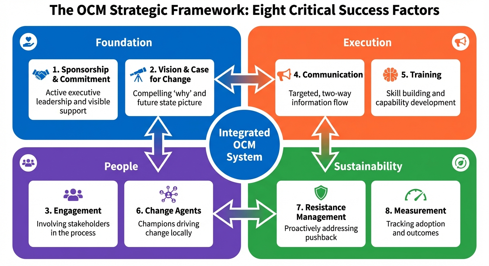
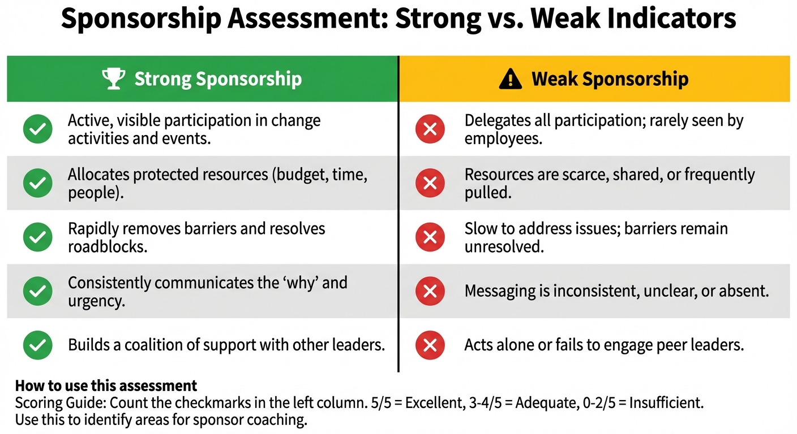
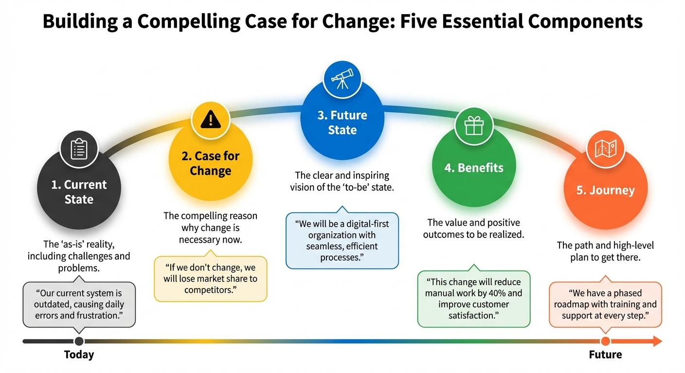
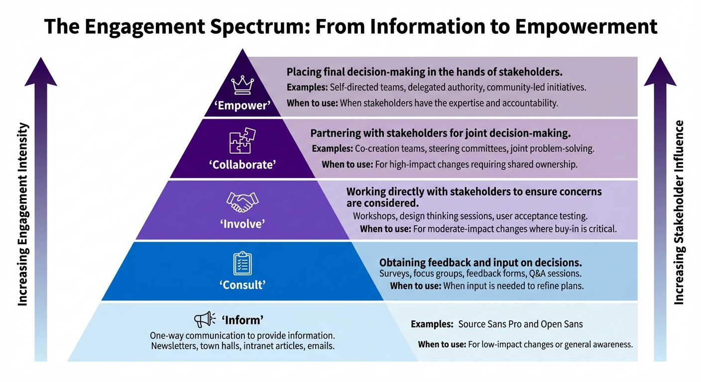
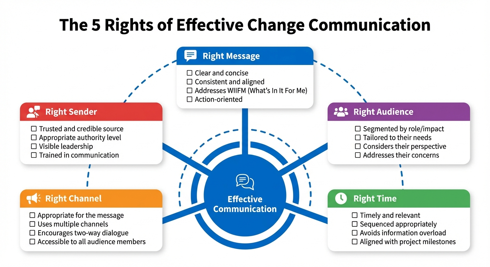
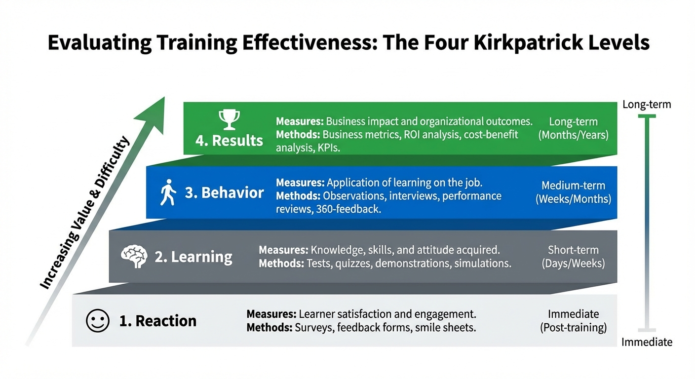

# Chapter 3: Strategic Framework and Critical Success Factors

## Learning Objectives

After completing this chapter, you will be able to:
- Explain the OCM strategic framework and its components
- Define and apply the 8 Critical Success Factors (CSFs)
- Understand how CSFs interconnect and support each other
- Assess organizational OCM capability against CSFs
- Develop strategies to strengthen weak CSFs

---

## The OCM Strategic Framework

The OCM Strategic Framework provides a structured approach to managing the people side of change. It integrates proven methodologies including Prosci ADKAR, Kotter's 8-Step Process, and ITIL 4 practices.

### Framework Components



*Figure 3.1: The OCM Strategic Framework organizes eight Critical Success Factors into four categories: Foundation (sponsorship and vision), People (engagement and change agents), Execution (communication and training), and Sustainability (resistance management and measurement).*

---

## The 8 Critical Success Factors

### CSF 1: Executive Sponsorship and Commitment

**Definition**: Active and visible executive support for the change, including resource allocation, barrier removal, and consistent messaging.

**Why It Matters**:
- Sponsorship is the #1 predictor of change success (Prosci research)
- Executives signal organizational priority
- Resources and authority flow from sponsorship
- Resistance decreases when leadership is visibly committed

**Key Indicators**:

| Strong Sponsorship | Weak Sponsorship |
|-------------------|------------------|
| Active participation in communications | Delegated to others |
| Visible presence at key events | Absent from change activities |
| Resources allocated and protected | Resources diverted or cut |
| Barriers actively removed | Issues escalated but unresolved |
| Consistent messaging | Mixed or contradictory messages |



*Figure 3.2: Use this assessment to evaluate sponsor effectiveness. Strong sponsorship shows active participation, visible presence, protected resources, rapid barrier removal, and consistent messaging. Count checkmarks in the left column for a quick effectiveness score.*

**Success Metrics**:
- Sponsor engagement score (participation in planned activities)
- Resource commitment maintained (% of planned resources)
- Barrier removal time (days from escalation to resolution)

---

### CSF 2: Clear Vision and Case for Change

**Definition**: A compelling narrative that explains why change is necessary, what the future state looks like, and why the chosen approach is right.

**Why It Matters**:
- Creates shared understanding and alignment
- Addresses "Why should I care?"
- Provides foundation for all communications
- Reduces uncertainty and speculation

**Vision Components**:

| Component | Description | Example |
|-----------|-------------|---------|
| Current State | Where we are today | "Manual processes causing 40% of incidents" |
| Case for Change | Why we must change | "Customer satisfaction declining, costs rising" |
| Future State | Where we're going | "Automated, efficient service management" |
| Benefits | Value to be realized | "50% faster resolution, 30% cost reduction" |
| Journey | How we'll get there | "Phased implementation over 12 months" |



*Figure 3.3: A compelling case for change articulates five essential components: the current state reality, why change is necessary, the future state vision, the benefits to be realized, and the journey to get there. Together these create a complete narrative that builds both awareness and desire.*

**Success Metrics**:
- Awareness level (% who can articulate why change is happening)
- Message consistency (alignment of understanding across groups)
- Vision clarity score (stakeholder survey)

---

### CSF 3: Stakeholder Engagement and Involvement

**Definition**: Systematic identification, analysis, and engagement of stakeholders throughout the change lifecycle.

**Why It Matters**:
- People support what they help create
- Early involvement identifies issues and improves solutions
- Engagement builds ownership and reduces resistance
- Stakeholders become advocates when meaningfully involved

**Engagement Levels**:

| Level | Description | Activities |
|-------|-------------|------------|
| **Inform** | One-way communication | Newsletters, emails, announcements |
| **Consult** | Gather input and feedback | Surveys, focus groups, interviews |
| **Involve** | Active participation in decisions | Workshops, working groups |
| **Collaborate** | Partnership in design | Co-creation sessions, pilots |
| **Empower** | Decision-making authority | Delegated ownership |



*Figure 3.4: Stakeholder engagement exists on a spectrum from one-way information (Inform) to delegated decision-making (Empower). Higher levels of engagement increase stakeholder influence and commitment but require more time and resources.*

**Success Metrics**:
- Stakeholder coverage (% engaged by group)
- Engagement quality score (stakeholder satisfaction with involvement)
- Feedback implementation rate (% of input acted upon)

---

### CSF 4: Effective Communication

**Definition**: Timely, relevant, and appropriately targeted communication that addresses stakeholder information needs throughout the change.

**Why It Matters**:
- Communication builds awareness and understanding
- Reduces rumors and misinformation
- Demonstrates transparency and respect
- Reinforces key messages consistently

**Communication Principles**:

1. **Right Message**: Content relevant to audience
2. **Right Audience**: Targeted by stakeholder group
3. **Right Time**: Appropriate timing in change lifecycle
4. **Right Channel**: Medium suited to message and audience
5. **Right Sender**: Credible source for that message
6. **Two-Way**: Mechanisms for feedback and questions



*Figure 3.5: Effective change communication applies the 5 Rights framework: deliver the Right Message to the Right Audience at the Right Time through the Right Channel from the Right Sender. All five elements must align for maximum impact.*

**Communication Matrix**:

| Audience | Key Messages | Channels | Frequency | Sender |
|----------|-------------|----------|-----------|--------|
| Executives | Progress, risks, decisions needed | Steering committee, email | Weekly | Project Lead |
| Managers | Team impacts, how to support | Team meetings, toolkit | Bi-weekly | Sponsor |
| End Users | What's changing, how to prepare | Town halls, intranet | Monthly | Manager |

**Success Metrics**:
- Communication reach (% who received key messages)
- Message comprehension (understanding checks)
- Communication satisfaction score

---

### CSF 5: Training and Capability Building

**Definition**: Structured learning experiences that build the knowledge, skills, and abilities needed to succeed in the future state.

**Why It Matters**:
- Knowledge is prerequisite for ability
- Reduces anxiety by building confidence
- Prevents errors and rework
- Accelerates time to proficiency

**Training Design Principles**:

| Principle | Application |
|-----------|-------------|
| Role-based | Tailored to specific job needs |
| Just-in-time | Delivered close to when needed |
| Blended | Mix of methods (classroom, e-learning, coaching) |
| Practice-oriented | Hands-on application opportunities |
| Reinforced | Followed up with support and refreshers |

**Training Effectiveness Levels** (Kirkpatrick):

| Level | Measure | Methods |
|-------|---------|---------|
| 1. Reaction | Satisfaction with training | Surveys, feedback |
| 2. Learning | Knowledge/skill acquisition | Tests, demonstrations |
| 3. Behavior | Application on the job | Observation, metrics |
| 4. Results | Business impact | KPIs, ROI |



*Figure 3.7: The Kirkpatrick Four-Level Model evaluates training effectiveness from immediate reaction through learning, behavior change, and ultimately business results. Higher levels require longer timeframes to measure but provide greater insight into training impact.*

**Success Metrics**:
- Training completion rate
- Proficiency assessment scores
- Time to competency

---

### CSF 6: Change Agent Network

**Definition**: A distributed network of individuals who advocate for, support, and enable change at all levels of the organization.

**Why It Matters**:
- Extends reach beyond project team
- Provides local, peer-level support
- Gathers ground-level feedback
- Sustains change after project ends

**Network Structure**:

```
Executive Sponsor (1)
       │
       └── Senior Change Champions (5-10)
                │
                └── Change Agents (20-50)
                         │
                         └── Peer Supporters (As needed)
```

**Change Agent Responsibilities**:
- Communicate change messages locally
- Support colleagues through transition
- Gather and escalate feedback
- Identify and report resistance
- Model desired behaviors
- Celebrate successes

**Success Metrics**:
- Network coverage (ratio of agents to impacted population)
- Agent engagement score
- Feedback volume and quality

---

### CSF 7: Resistance Management

**Definition**: Proactive identification, analysis, and management of resistance to change throughout the lifecycle.

**Why It Matters**:
- Unmanaged resistance derails projects
- Early intervention is more effective
- Resistance often indicates legitimate concerns
- Addressing resistance builds trust

**Resistance Management Process**:

1. **Anticipate**: Identify likely sources based on impact analysis
2. **Listen**: Create channels for concerns to surface
3. **Diagnose**: Understand root causes (ADKAR gaps)
4. **Address**: Develop targeted interventions
5. **Monitor**: Track resistance levels over time

**Resistance Response Strategies**:

| Root Cause | Response Strategy |
|------------|-------------------|
| Lack of awareness | Enhanced communication |
| Low desire | Sponsor engagement, WIIFM |
| Knowledge gaps | Training, demonstrations |
| Ability barriers | Coaching, support, barrier removal |
| Reinforcement issues | Recognition, accountability |

**Success Metrics**:
- Resistance level (% showing active resistance)
- Issue resolution time
- Resistance trend (improving/stable/worsening)

---

### CSF 8: Measurement and Reinforcement

**Definition**: Systematic tracking of adoption progress and reinforcement mechanisms that sustain change over time.

**Why It Matters**:
- What gets measured gets managed
- Data enables course correction
- Recognition reinforces desired behaviors
- Accountability prevents backsliding

**Measurement Framework**:

| Category | Metrics | Target |
|----------|---------|--------|
| Adoption | Usage rates, proficiency levels | 85%+ adoption |
| Speed | Time to proficiency | Within 60 days |
| Quality | Error rates, compliance | <5% errors |
| Satisfaction | User sentiment | 4.0+ score |
| Business | Benefits realization | 100% of projected |

**Reinforcement Mechanisms**:
- Recognition programs and celebrations
- Performance management alignment
- Success stories and case studies
- Compliance monitoring
- Continuous improvement actions

**Success Metrics**:
- Sustainment rate (adoption maintained at 6+ months)
- Benefits realization percentage
- Continuous improvement actions implemented

---

## CSF Interdependencies

The 8 CSFs work together as a system. Note: Figure 3.6 is not available.

---

## Key Takeaways

- **8 CSFs provide a comprehensive framework** for OCM success
- **Executive sponsorship is foundational** - the #1 predictor of success
- **CSFs work as a system** - weakness in one affects others
- **Each CSF has measurable indicators** for tracking effectiveness
- **Regular assessment against CSFs** enables proactive improvement

---

## Summary

The 8 Critical Success Factors provide a comprehensive framework for planning and executing organizational change management. Executive sponsorship forms the foundation; clear vision provides direction; stakeholder engagement builds ownership; communication creates understanding; training builds capability; change agents extend reach; resistance management addresses barriers; and measurement ensures sustainability. Together, these CSFs create the conditions for successful change adoption.

---

## Chapter Navigation

| Previous | Next |
|----------|------|
| [Chapter 2: Core Concepts](/OrganizationalChangeManagementHandbook/chapters/02-core-concepts/) | [Chapter 4: Change Readiness Assessment](/OrganizationalChangeManagementHandbook/chapters/04-readiness-assessment/) |
